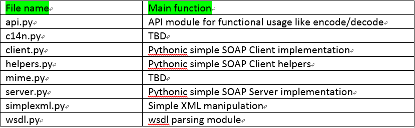
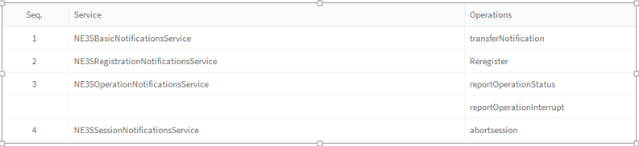
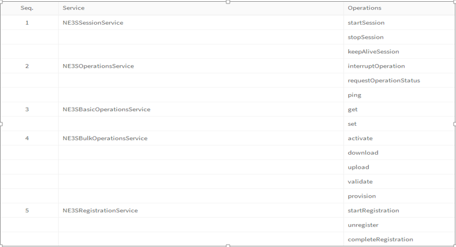

#PySimpleSOAP introduction

The PySimpleSoap Library is transplanted from http://code.google.com/p/pysimplesoap/.And just changed interface base on it that can service for NOKIA NBS project.
Main function : Have four main modules: client, server, soap msg decode, soap msg encode; Parse the WSDL file.

##PySimpleSOAP structure specificaiton

Main file in PySimpleSOAP

|File name|Main function
----------|--------------------
api.py    |Soap message decode
client.py |Simulate a client,send request and get response
mime.py   |Structure MIME part of msg
server.py |Pythonic simple SOAP Server implementation,nbs only use dispatcher module
simplexml.py|Simple XML manipulation,structure xml msg
wsdl.py   |wsdl parsing module

api.py: Decode soap message to a dict
* Get content_type from headers
* Get boundary from content_type
* Get body content by splitting body
* Get the xml content
* Sending the xml content to simplexml. SimpleXMLElement, return the dict

client.py: Startup a client and interactive with server
* Handler the arguments
* Structure soap message’s body and header
* Start a client and post the request to server(IMP)
* Get the response from server
* Call api.decode to decode response

mime.py: structure soap message body
* Import uuid module and create boundary base on timestamp
* Write in Content-Type and soap body
* Write in the attachment file

server.py: only introduce SoapDispatcher class
* Simple Dispatcher for SOAP Server
* Corresponding server dispatch by uri，soapaction
* Get response operation by dispatch
* Input case response parameter
* Encode Response to xml form and return data.

simplexml.py: structure xml msg according to arguments

wsdl.py: Parse WSDL file
* Parse wsdl file to five variable value (elements, messages, port_types, bindings, services)
* Our NBS project only used the ‘services’ dict
* The dict have 9 services and 21 Operations

Seq.|Service                          |Operations
----|---------------------------------|--------------
1---|NE3SBasicNotificationService-----|transferNotification
2---|NE3SRegistrationNotificationService|Reregister
3---|NE3SOperationNotificaitonService-|reportOperationStatus
----|---------------------------------|reportOperationInterrupt
4---|NE3SSessionNotificationsService--|abortsession

